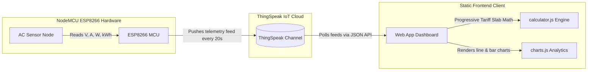

# ⚡ Smart Bill Monitoring System (IoT Dashboard)

An advanced Internet of Things (IoT) electricity telemetry dashboard and calculation engine. This project acquires live sensor feeds (Voltage, Current, Power, Cumulative Energy) from a remote microcontroller node (NodeMCU/ESP8266) via the **ThingSpeak cloud API**, maps them into a high-performance web dashboard, visualizes load trend histories with **Chart.js**, and calculates real-time cost estimations using standard progressive slab utility tariffs.

---

## 🏗️ System Architecture

The project consists of three main architectural layers:


1. **Hardware Telemetry Node (Client):** A NodeMCU ESP8266 microcontroller connected to an AC monitoring circuit (e.g., PZEM-004T sensor). It samples voltage, current, power, and cumulative energy consumed (kWh), streaming them to ThingSpeak channel fields.
2. **IoT Cloud Broker (Middleware):** **ThingSpeak** hosts the channels and provides an open REST API to pull historical readings as a JSON stream.
3. **Responsive Web Client (Frontend):** A vanilla HTML/CSS/JavaScript client that handles network polling, calculates active slab pricing, manages synchronization state transitions, and renders real-time responsive analytics.

---

## 🌟 Key Features

* **Real-time Telemetry Dashboard:** Live meters displaying AC Mains Voltage (V), Load Current (A), Instantaneous Power Draw (W), Cumulative Energy (kWh), and Current Bill Cost (Rs.).
* **Dynamic Tariff Slab Engine:** Implements progressive slab calculations matching standard power utility grids:
  - **Slab 1:** 0–100 units $\rightarrow$ ₹4.00 / unit
  - **Slab 2:** 101–200 units $\rightarrow$ ₹6.00 / unit
  - **Slab 3:** 200+ units $\rightarrow$ ₹8.00 / unit
* **Monthly Estimator:** Projects 30-day (720 hours) billing and unit consumption based on average load power draws over historical sliding windows.
* **Rich Analytics Charts:** Historical line charts for load profile and mains voltage stability alongside cumulative bar charts for day-by-day energy consumption.
* **Sync & Stability Guards:**
  - **Overlapping Request Guards:** Prevents concurrent fetch collisions.
  - **Exponential Backoff Retry Strategy:** Failed API requests schedule auto-retries at 2s, 4s, and 8s intervals before logging offline.
  - **Connection State Badging:** Status indicator transitions dynamically between `Syncing ⟳`, `Online`, and `Offline / Error`.
  - **Pulsing Skeleton Loaders:** Shimmering elements indicate loading states before the initial sync to remove visual pop-in.
  - **Stale Data Preservation:** Dimmer transparency indicates offline cache status while preserving metrics context rather than wiping screen values.
* **API Credentials Override:** Directly customize or change the target ThingSpeak channel and read keys from the UI settings. Changes persist in client `localStorage`.

---

## 📂 Codebase Structure

```
smart-bill-monitor/
│
├── index.html            # Main Live Telemetry Dashboard page
├── dashboard.html        # Analytics, Hardware Health, and Billing Settings page
├── style.css             # Main layout, typography, glassmorphism UI, and keyframe animations
├── mobile.css            # Responsive layout adjustments and media queries for tablets & mobiles
│
├── config.js             # API Configuration layer (resolves default or localStorage credentials)
├── api.js                # Core network communication module querying the ThingSpeak JSON API
├── app.js                # Main application controller, binding UI events and polling intervals
├── charts.js             # Chart.js initialization and data dataset updating module
└── calculator.js         # Progressive slab cost engine and monthly estimation project math
```

---

## ⚙️ Configuration & Local Development

### 1. Default API Keys Setup
By default, the dashboard is configured to read from a demo ThingSpeak Channel. If you want to configure your own hardware channel default credentials, modify `config.js`:
```javascript
const CONFIG = {
    get CHANNEL_ID() {
        return localStorage.getItem('thingspeak_channel_id') || 'YOUR_CHANNEL_ID';
    },
    get READ_API_KEY() {
        return localStorage.getItem('thingspeak_read_api_key') || 'YOUR_READ_API_KEY';
    },
    ...
```

