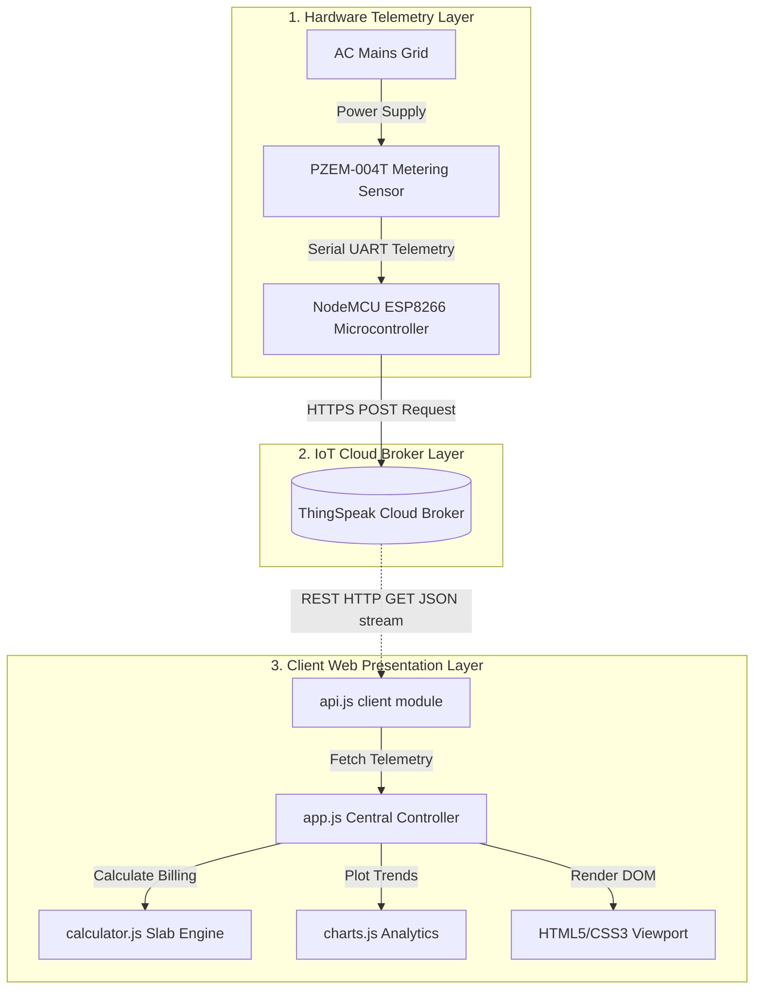
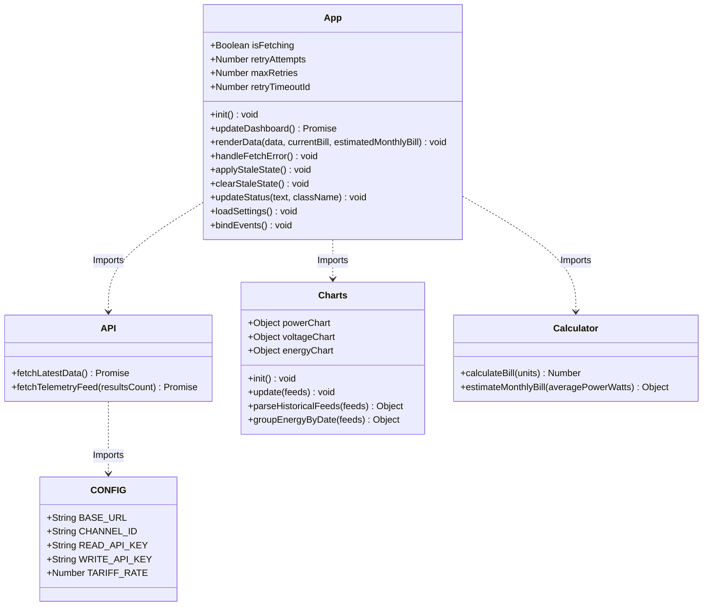
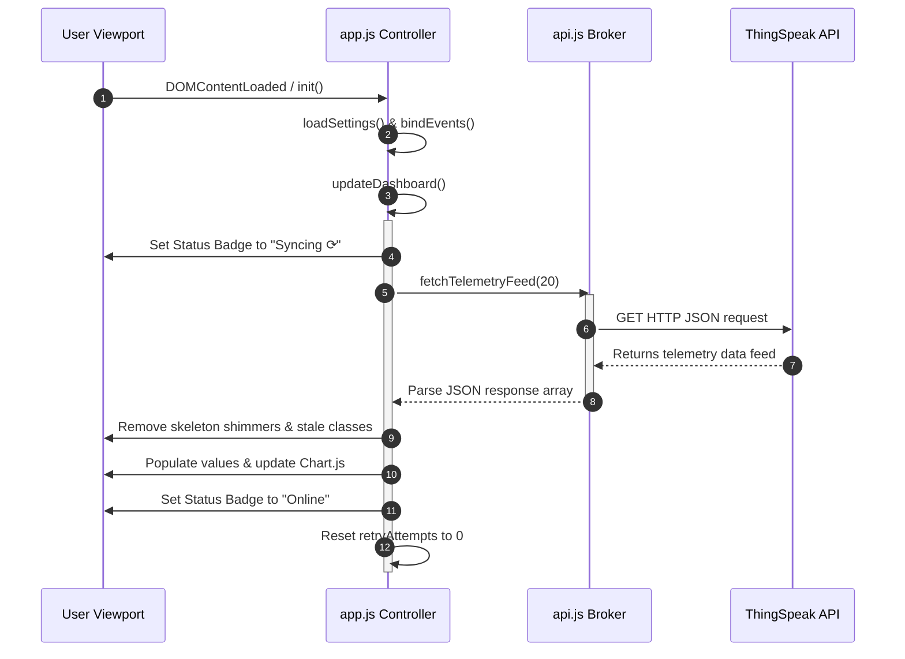

# Engineering Project Report: Smart Bill Monitoring System

**System Version:** v1.0.0-production  
**Author:** SmartBill Project Team  
**Category:** IoT Energy Telemetry & Analysis System  

---

## Abstract

Modern residential and commercial utility management suffers from a lack of immediate, high-fidelity feedback regarding energy consumption and billing. Users generally receive bills retrospectively, preventing proactive modifications in energy consumption behaviors. The **Smart Bill Monitoring System** is an end-to-end Internet of Things (IoT) solution designed to capture live electrical telemetry, stream it to a cloud broker, analyze historical loads, and calculate running tariff billing. This report details the hardware-cloud integration, ES module application architecture, progressive billing calculation engine, network stability protocols, and future expansion directions.

---

## 1. Introduction

With the rise of smart cities and home automation, real-time telemetry systems have transitioned from luxury installations to operational necessities. The primary objectives of this system are:
1. To establish real-time visibility over key AC mains parameter feeds: Voltage (V), Load Current (A), and Active Power Draw (W).
2. To calculate consumption rates and map them to localized slab tariffs dynamically.
3. To predict monthly billing profiles using historical averages, allowing consumers to budget energy footprints.
4. To implement a highly stable, resilient web frontend interface capable of self-healing during communication outages.

---

## 2. System Architecture

The Smart Bill Monitoring System is structured into three decoupled layers: the Hardware Telemetry Node, the Cloud API Broker, and the Client Presentation Web App.



### 2.1 Hardware Telemetry Layer
The physical sensor node comprises:
- **NodeMCU ESP8266 Board:** Serves as the micro-processing unit, equipped with an on-chip Wi-Fi transceiver to stream data to cloud nodes.
- **PZEM-004T AC Sensor:** Measures RMS voltage (V), active load current (A), active power (W), and cumulative energy consumption (kWh) on the AC electrical mains line.
- **Microcontroller Firmware:** Developed in C/C++ (Arduino IDE environment), utilizing WiFi managers to establish cloud connections and executing data payloads every 20 seconds.

### 2.2 Cloud API Broker Layer
The **ThingSpeak IoT platform** functions as the broker layer:
- Acts as a rate-limited telemetry repository, tracking data fields (Field 1: Voltage, Field 2: Current, Field 3: Power, Field 4: Energy).
- Exposes a RESTful JSON API enabling client browsers to pull raw feeds dynamically.

### 2.3 Client Web Presentation Layer
A vanilla HTML5/CSS3/ES6 static web application. It functions entirely client-side, making it highly portable for hosting on static servers (like GitHub Pages or Netlify). It uses modular JS files to coordinate fetching, calculation, UI updates, and Chart.js visualizations.

---

## 3. Software Module Descriptions

The web application is split into specialized, reusable scripts using ES Modules (`import`/`export`):



### 3.1 config.js
Provides the configuration layer. It includes Javascript property getters (`get CHANNEL_ID()`, etc.) that inspect `localStorage` first, letting users configure custom feeds dynamically via the Settings UI without editing local files.

### 3.2 api.js
Interacts directly with the ThingSpeak Cloud JSON endpoints. It provides `fetchLatestData()` for simple checks and `fetchTelemetryFeed(resultsCount)` to fetch a sliding history window (default: 20 feeds) in a single request, reducing rate-limiting blockages.

### 3.3 calculator.js
Handles all utility computations. Features isolated functions for progressive tariff calculations and monthly power consumption projections.

### 3.4 charts.js
Initializes and controls three **Chart.js** canvases:
1. **Power Draw Trend:** A smooth line graph representing power profile variations (Watts).
2. **Voltage Stability:** A line graph demonstrating AC mains fluctuations (Volts).
3. **Energy Consumption History:** A bar graph tracking day-to-day cumulative energy consumption (kWh).

### 3.5 app.js
Acts as the central orchestrator. It manages the refresh loop (15-second intervals), prevents overlapping calls using a request serialization guard, implements exponential retry mechanisms, loads saved user options, updates connection status badges, and controls visual loading states.

---

## 4. Software & API Workflow

The core state lifecycle of the client application is designed to prioritize reliability and responsiveness.



### 4.1 Request Overlap Guard
To prevent API request collisions, `app.js` runs a boolean guard:
```javascript
if (this.isFetching) return;
```
If a telemetry fetch is slow, any secondary interval triggers are blocked, preventing browser socket congestion.

### 4.2 Exponential Backoff Retry Protocol
If communication fails (due to network drops or broker timeouts), the app initiates backoff retries:
1. **Attempt 1:** Triggers after 2 seconds delay.
2. **Attempt 2:** Triggers after 4 seconds delay.
3. **Attempt 3:** Triggers after 8 seconds delay.
4. **Offline State:** If all 3 attempts fail, the system declares an offline state, sets the badge to `Offline / Error`, and waits for the next regular 15-second timer refresh.

If a scheduled timer triggers *during* a retry delay, the pending retry timeout is cleared:
```javascript
if (this.retryTimeoutId) {
    clearTimeout(this.retryTimeoutId);
    this.retryTimeoutId = null;
}
```

### 4.3 Stale Data Dimming Cache
Rather than clearing telemetry cards when offline (which loses context), the app retains last known values but adds the `.stale` class:
```css
.stale {
    opacity: 0.55;
    transition: opacity 0.5s ease;
}
```
This signals to the user that the values are cached and not currently updating.

---

## 5. Billing Slab Tariff Engine

The billing calculations reside in `calculator.js`.

### 5.1 Progressive Slab Tariff Calculations
Calculations use a progressive slab scheme rather than a flat rate. Slabs are computed sequentially:

$$\text{Bill Amount} = \begin{cases} 
      u \times 4.00 & \text{if } u \le 100 \\
      (100 \times 4.00) + (u - 100) \times 6.00 & \text{if } 100 < u \le 200 \\
      (100 \times 4.00) + (100 \times 6.00) + (u - 200) \times 8.00 & \text{if } u > 200 
   \end{cases}$$

Where $u$ is the cumulative units consumed (kWh). This progressive approach ensures exact mathematical compliance with grid billing logic.

### 5.2 Monthly Projections
Projections are based on the average active power draw (Watts) sampled across the active sliding history window:

$$\text{Projected Monthly Consumption (kWh)} = \frac{\text{Average Power (W)} \times 720 \text{ hours (30 Days)}}{1000}$$

This projected consumption is then fed through the progressive tariff slab logic to provide the estimated monthly bill.

---

## 6. Future Scope & Enhancements

While v1.0.0 represents a robust, demo-ready platform, future milestones could include:
1. **Interactive Control Relays:** Sending write commands back to ThingSpeak to toggle hardware relays on the NodeMCU node, enabling remote load-shedding when bills exceed limits.
2. **Predictive Analytics:** Integrating basic Machine Learning models (like regression models) to analyze weekly usage patterns and predict peak load times.
3. **Power Factor & Distortion Monitoring:** Extending the hardware layers to monitor power factors and harmonics, helping to diagnose line inefficiencies.

---

## 7. Conclusion

The Smart Bill Monitoring System provides a stable, user-centric solution for real-time electrical telemetry. By decoupling sensor transmission from client visualization through a cloud broker, the system achieves excellent performance and accessibility. Combining progressive slab cost estimation, Chart.js trends, and offline stability protocols (such as exponential backoff retries and stale data dimming) delivers an academic-grade, production-ready IoT dashboard.
